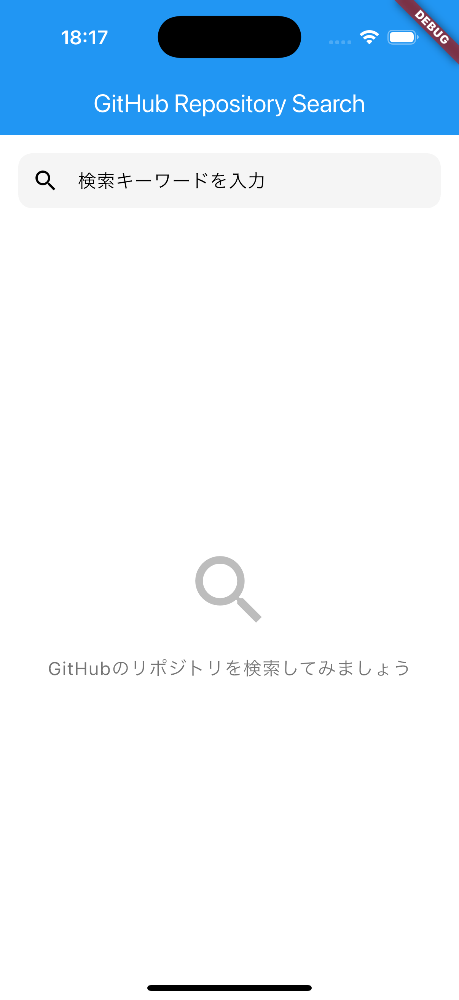
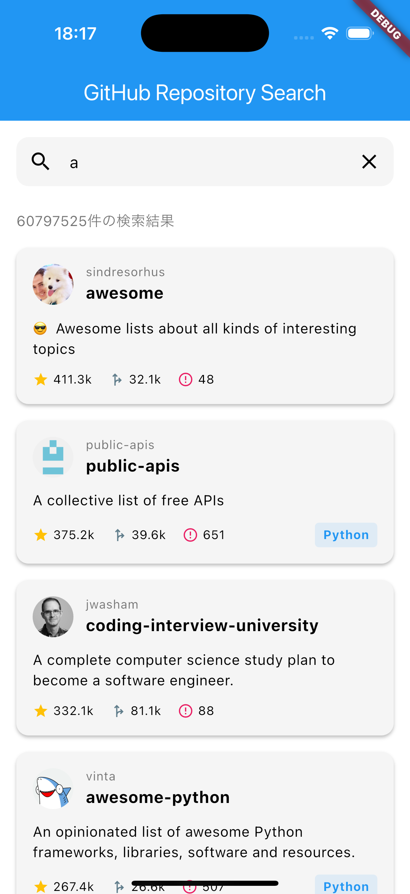
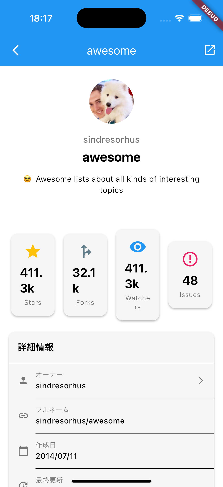
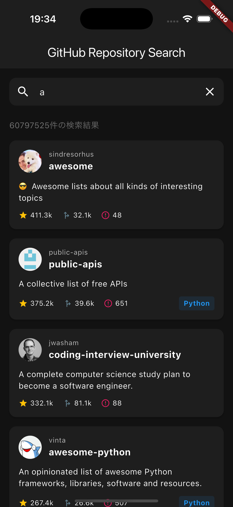

# ゆめみFlutterコーディングテスト - GitHubリポジトリ検索アプリ

<p align="center">
  
  
  
</p>

GitHubのリポジトリを検索・閲覧できるFlutterアプリケーションです。

---

## 📱 機能

### 実装済み機能

- ✅ **リポジトリ検索**
  - キーワード検索
  - Star数降順でソート
  - リアルタイム入力対応

- ✅ **検索結果一覧表示**
  - リポジトリカード表示
  - オーナー情報（アイコン、名前）
  - 統計情報（Star、Fork、Issue数）
  - 使用言語バッジ

- ✅ **リポジトリ詳細表示**
  - 詳細な統計情報
  - 作成日・更新日
  - GitHubで開く機能

- ✅ **エラーハンドリング**
  - ネットワークエラー
  - タイムアウト
  - レートリミット（GitHub API制限）
  - 空状態の表示

- ✅ **UI/UX**
  - ライトモード/ダークモード対応
  - Material Design 3準拠
  - レスポンシブデザイン

---

## 🏗️ アーキテクチャ

### 技術スタック

| カテゴリ | 技術 | 用途 |
|---------|------|------|
| **状態管理** | Riverpod (riverpod_annotation) | アプリケーション状態管理 |
| **API通信** | Dio | HTTP通信 |
| **データクラス** | Freezed + json_serializable | 不変データモデル |
| **多言語対応** | flutter_localizations | 日本語・英語対応（準備済み） |
| **テスト** | flutter_test + Mockito | Unit Test |

### ディレクトリ構成

```
lib/
├── main.dart                    # エントリーポイント
├── app.dart                     # MaterialApp設定
├── common/                      # 共通機能
│   ├── extensions/             # 拡張機能
│   ├── providers/              # 共通Provider
│   └── widgets/                # 共通Widget
├── features/                    # 機能単位（Feature-First）
│   ├── search/                 # 検索機能
│   │   ├── presentation/       # UI層
│   │   ├── provider/           # 状態管理
│   │   └── widget/             # 専用Widget
│   └── repository_detail/      # 詳細機能
├── models/                      # データモデル
│   └── github_repository.dart
├── services/                    # ビジネスロジック
│   ├── api/                    # API通信
│   └── repository/             # リポジトリパターン
└── theme/                       # テーマ設定

test/
├── models/                      # モデルのテスト
├── features/                    # 機能のテスト
└── services/                    # サービスのテスト
```

### 設計パターン

#### 1. Feature-First Architecture
機能単位でディレクトリを分割し、関連するコードをまとめています。

#### 2. 単方向データフロー
```
ユーザー入力 → Provider → State → UI更新
```

#### 3. レイヤー分離
- **Presentation Layer**: UI・画面
- **Provider Layer**: 状態管理・ビジネスロジック
- **Service Layer**: API通信・外部サービス
- **Model Layer**: データ構造

---

## 🚀 セットアップ

### 必要な環境

- Flutter SDK: 3.0以上
- Dart: 3.0以上

### インストール手順

1. **リポジトリをクローン**
```bash
git clone https://github.com/tkt12/yumemi-flutter-github-repository-search.git
cd yumemi-flutter-github-repository-search
```

2. **依存パッケージをインストール**
```bash
flutter pub get
```

3. **コード生成**
```bash
dart run build_runner build --delete-conflicting-outputs
```

4. **アプリを起動**
```bash
flutter run
```

---

## 🧪 テスト

### テストの実行

```bash
# すべてのテストを実行
flutter test

# カバレッジ付きで実行
flutter test --coverage

# 特定のテストファイルのみ実行
flutter test test/features/search/provider/search_provider_test.dart
```

### テストカバレッジ

- **SearchNotifier**: 6テスト
- **GitHubRepository**: 9テスト
- **合計**: 15テスト

### テスト構成

#### Unit Test
- ✅ `SearchNotifier` - 検索ロジックのテスト
- ✅ `GitHubRepository` - データモデルのテスト

#### 使用技術
- **Mockito**: GitHubApiClientのモック化
- **flutter_test**: Flutterテストフレームワーク
- **Riverpod Testing**: ProviderContainerを使用

---

## 🎨 UI/UX

### ライトモード / ダークモード

システム設定に応じて自動的に切り替わります。

### カラーパレット

| 用途 | ライトモード | ダークモード |
|-----|------------|-------------|
| Primary | `#2196F3` | `#42A5F5` |
| Background | `#FFFFFF` | `#121212` |
| Surface | `#F5F5F5` | `#1E1E1E` |

---

## 🔧 技術的な実装ポイント

### 1. エラーハンドリング

カスタム例外クラスを定義し、ユーザーフレンドリーなエラーメッセージを表示します。

```dart
// lib/services/api/api_exception.dart
class NetworkException extends ApiException { }
class RateLimitException extends ApiException { }
class TimeoutException extends ApiException { }
```

### 2. Riverpod状態管理

`riverpod_annotation`を使用してコード生成ベースの実装を採用。

```dart
@riverpod
class SearchNotifier extends _$SearchNotifier {
  @override
  SearchState build() => const SearchState();
  
  Future<void> search(String query) async {
    // 検索ロジック
  }
}
```

### 3. Freezedデータモデル

不変データクラスとJSON変換を自動生成。

```dart
@freezed
class GitHubRepository with _$GitHubRepository {
  const factory GitHubRepository({
    required int id,
    @JsonKey(name: 'stargazers_count') required int stargazersCount,
  }) = _GitHubRepository;
  
  factory GitHubRepository.fromJson(Map<String, dynamic> json) =>
      _$GitHubRepositoryFromJson(json);
}
```

### 4. スネークケース ↔ キャメルケース変換

GitHub APIのスネークケースをDartのキャメルケースに自動変換。

```dart
@JsonKey(name: 'stargazers_count')  // API: stargazers_count
int stargazersCount;                 // Dart: stargazersCount
```

---

## 📊 GitHub API

### エンドポイント

```
GET https://api.github.com/search/repositories
```

### パラメータ

| パラメータ | 説明 | デフォルト値 |
|----------|-----|------------|
| `q` | 検索キーワード | - |
| `sort` | ソート順 | `stars` |
| `order` | 昇順/降順 | `desc` |
| `per_page` | 1ページあたりの件数 | `30` |

### レート制限

- **認証なし**: 1時間あたり60リクエスト
- **認証あり**: 1時間あたり5000リクエスト

現在の実装は認証なしで動作します。

---

## 🔐 セキュリティ

### ネットワーク権限

#### macOS
```xml
<key>com.apple.security.network.client</key>
<true/>
```

#### iOS
HTTPSはデフォルトで許可されているため、追加設定不要。

#### Android
```xml
<uses-permission android:name="android.permission.INTERNET"/>
```

---

## 📦 主要な依存パッケージ

```yaml
dependencies:
  flutter_riverpod: ^2.5.1      # 状態管理
  riverpod_annotation: ^2.3.5   # Riverpod自動生成
  dio: ^5.4.3+1                 # HTTP通信
  freezed_annotation: ^2.4.1    # 不変データクラス
  json_annotation: ^4.9.0       # JSON変換

dev_dependencies:
  build_runner: ^2.4.9          # コード生成
  riverpod_generator: ^2.4.0    # Riverpod生成
  freezed: ^2.5.2               # Freezed生成
  json_serializable: ^6.8.0     # JSON生成
  mockito: ^5.4.4               # モック生成
```

---

## 🤝 開発プロセス

### ブランチ戦略

```
feature/xxx → develop → main
```

### コミットメッセージ規約

```
feat: 新機能
fix: バグ修正
docs: ドキュメント
test: テスト
refactor: リファクタリング
chore: 設定・ツール
style: フォーマット
```

## 📱 スクリーンショット

### 検索画面


### 検索結果


### 詳細画面


### ダークモード


---

## 📄 ライセンス

MIT License

---

## 👤 作成者

- GitHub: [@tkt12](https://github.com/tkt12)
- プロジェクト: [yumemi-flutter-github-repository-search](https://github.com/tkt12/yumemi-flutter-github-repository-search)

---

## 🙏 謝辞

このプロジェクトは[株式会社ゆめみ](https://www.yumemi.co.jp/)のFlutterコーディングテストの課題として作成されました。

### 参考資料
- [ゆめみFlutterコーディングテスト仕様](https://github.com/yumemi-inc/flutter-engineer-codecheck)
- [Flutter公式ドキュメント](https://flutter.dev/)
- [Riverpod公式ドキュメント](https://riverpod.dev/)
